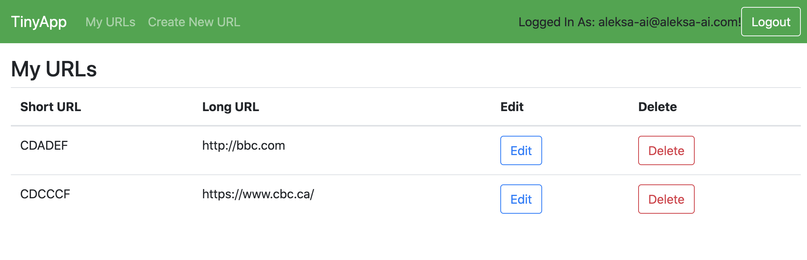
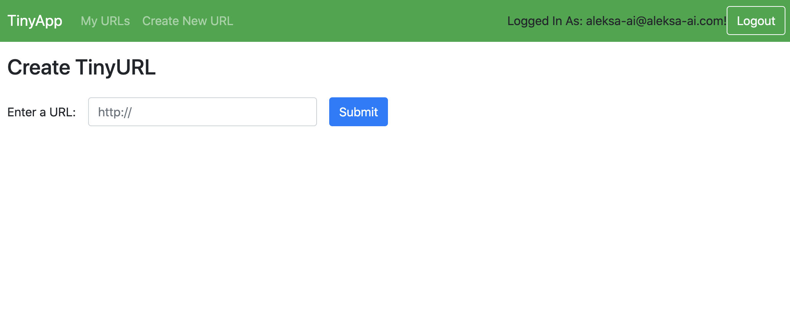
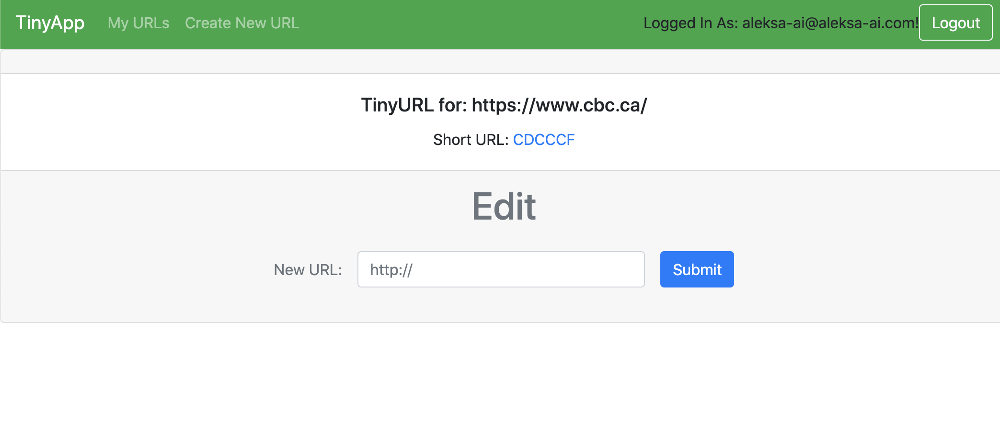

# TinyApp Project

*This project has been delievered in the third week of Lighthouse Labs' Web Development Bootcamp*

## End-result description

TinyApp is a full stack web application built with Node and Express that allows users to shorten long URLs (à la bit.ly).
The app allows users to register in order to enable creation, editing, and storage of each user's own shortened URLs.
Security features include password hashing and cookie encryption.

## Final Product

## Dependencies

- Node.js
- Express
- EJS
- bcrypt
- body-parser
- cookie-session

## Getting Started

- Install all dependencies (using the `npm install` command).
- Run the development web server using the `node express_server.js` command.
